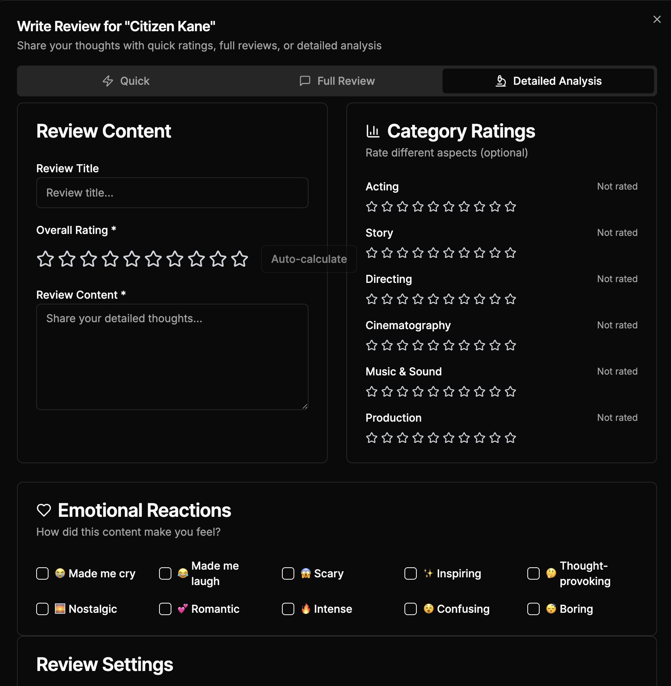
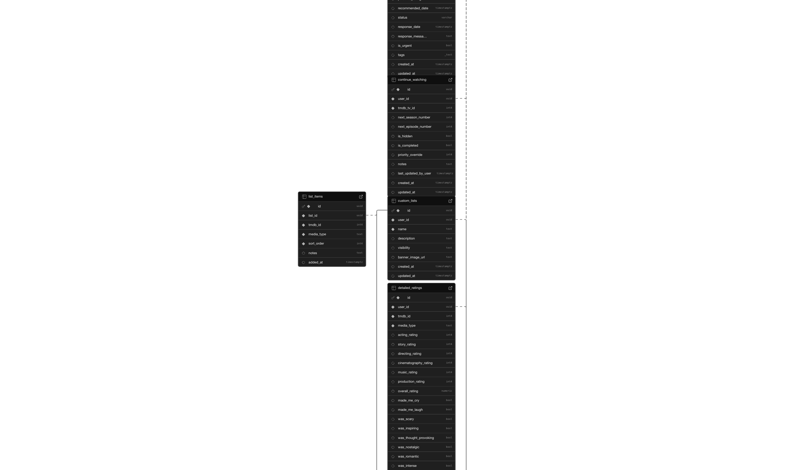

# 🎬 CineTrack

<div align="center">
  
  
  <p align="center">
    <strong>A comprehensive web application for movie and TV show enthusiasts to track, review, and discover visual content</strong>
  </p>

  <p align="center">
    <a href="#features"><strong>Features</strong></a> ·
    <a href="#demo"><strong>Demo</strong></a> ·
    <a href="#screenshots"><strong>Screenshots</strong></a> ·
    <a href="#installation"><strong>Installation</strong></a> ·
    <a href="#tech-stack"><strong>Tech Stack</strong></a> ·
    <a href="#contributing"><strong>Contributing</strong></a>
  </p>

  <p align="center">
    
    
    
    
    
    
  </p>
</div>

## 🌟 Features

### 🎭 Content Discovery & Browsing
- **Rich Content Database**: Browse movies and TV shows powered by TMDB API
- **Advanced Search**: Find content with autocomplete, filters, and advanced search options
- **Personalized Recommendations**: AI-powered suggestions based on your viewing history
- **Trending & Popular**: Stay updated with what's hot in entertainment
- **Genre & Category Browsing**: Explore content by genres, networks, and curated collections


### 📝 Personal Tracking & Reviews
- **Watch History**: Track what you've watched with dates and personal ratings
- **Detailed Reviews**: Write comprehensive reviews with category-specific ratings
- **Episode Tracking**: Monitor TV show progress episode by episode
- **Watchlist Management**: Organize what you want to watch next
- **Custom Lists**: Create and share themed collections


### 🤝 Social Features
- **User Profiles**: Showcase your viewing habits and reviews
- **Follow System**: Connect with other movie enthusiasts
- **Activity Feed**: See what your friends are watching and reviewing
- **Review Interactions**: Like, comment, and engage with community reviews
- **Public Lists**: Share and discover curated content collections


### 🎯 Advanced Features
- **Enhanced Rating System**: Rate content across multiple categories (acting, story, directing, etc.)
- **Emotional Reactions**: Tag content with emotional responses (made me cry, scary, etc.)
- **Watch Providers**: See where content is available to stream or rent
- **Notification System**: Stay updated on new releases and social activity
- **Dark/Light Theme**: Customizable viewing experience
- **Mobile-First Design**: Optimized for all devices



### 🔒 Privacy & Security
- **Granular Privacy Controls**: Control who sees your activity (public, followers, private)
- **Content Moderation**: Report inappropriate content and reviews
- **Secure Authentication**: Email/password and social login options
- **Data Protection**: GDPR-compliant user data handling

## 🚀 Demo

**Live Demo**: [https://cine-track-nine.vercel.app/](https://cine-track-nine.vercel.app/)

**Test Account**: 
- Email: demo@cine-track.app
- Password: demo123

> Note: The demo account has sample data to showcase all features.

## 📱 Screenshots

### Homepage & Discovery


### Movie/TV Show Details


### Mobile Experience
<div align="center">
  
  
  
</div>


## 🛠️ Tech Stack

### Frontend
- **[Next.js 14](https://nextjs.org/)** - React framework with App Router
- **[React 19](https://react.dev/)** - UI library with latest features
- **[TypeScript](https://www.typescriptlang.org/)** - Type-safe JavaScript
- **[Tailwind CSS](https://tailwindcss.com/)** - Utility-first CSS framework
- **[Shadcn/UI](https://ui.shadcn.com/)** - High-quality UI components
- **[TanStack Query](https://tanstack.com/query)** - Server state management
- **[React Hook Form](https://react-hook-form.com/)** - Form handling
- **[Zod](https://zod.dev/)** - Schema validation

### Backend & Database
- **[Supabase](https://supabase.com/)** - Backend-as-a-Service
  - PostgreSQL database
  - Authentication & authorization
  - Real-time subscriptions
  - File storage
  - Row Level Security (RLS)
- **[TMDB API](https://www.themoviedb.org/documentation/api)** - Movie & TV data

### Development & Testing
- **[Jest](https://jestjs.io/)** - Testing framework
- **[Testing Library](https://testing-library.com/)** - React testing utilities
- **[Cypress](https://www.cypress.io/)** - E2E testing
- **[ESLint](https://eslint.org/)** - Code linting
- **[Prettier](https://prettier.io/)** - Code formatting

### Deployment & Monitoring
- **[Vercel](https://vercel.com/)** - Frontend deployment
- **[Sentry](https://sentry.io/)** - Error monitoring
- **Performance monitoring** - Built-in analytics

## 🚀 Installation

### Prerequisites
- Node.js 18+ and npm
- Supabase account
- TMDB API key

### 1. Clone the Repository
```bash
git clone https://github.com/AliveOrdinary/cine-track.git
cd cine-track
```

### 2. Install Dependencies
```bash
npm install
```

### 3. Environment Setup
Create a `.env.local` file in the root directory:

```env
# Supabase Configuration
NEXT_PUBLIC_SUPABASE_URL=your_supabase_project_url
NEXT_PUBLIC_SUPABASE_ANON_KEY=your_supabase_anon_key
SUPABASE_SERVICE_ROLE_KEY=your_supabase_service_role_key

# TMDB API
NEXT_PUBLIC_TMDB_API_KEY=your_tmdb_api_key
NEXT_PUBLIC_TMDB_READ_ACCESS_TOKEN=your_tmdb_read_access_token

# Optional: Sentry (for error monitoring)
NEXT_PUBLIC_SENTRY_DSN=your_sentry_dsn
SENTRY_ORG=your_sentry_org
SENTRY_PROJECT=your_sentry_project
SENTRY_AUTH_TOKEN=your_sentry_auth_token
```

### 4. Database Setup
Run the database migrations:

```bash
# Install Supabase CLI if you haven't already
npm install -g supabase

# Link to your Supabase project
supabase link --project-ref your_project_ref

# Run migrations
supabase db push
```

Or apply migrations manually in your Supabase dashboard using the SQL files in `supabase/migrations/`.

### 5. Start Development Server
```bash
npm run dev
```

Visit [http://localhost:3000](http://localhost:3000) to see the application.

## 🗄️ Database Schema

The application uses a comprehensive PostgreSQL schema with the following key tables:

- **`users`** - User profiles and authentication
- **`watched_content`** - User's viewing history
- **`reviews`** - User reviews and ratings
- **`enhanced_reviews`** - Detailed category-based reviews
- **`watchlist_content`** - User's watchlist items
- **`custom_lists`** - User-created lists
- **`follows`** - User follow relationships
- **`notifications`** - System notifications
- **`reports`** - Content moderation reports



## 🧪 Testing

### Run All Tests
```bash
# Unit and integration tests
npm test

# With coverage report
npm run test:coverage

# Watch mode for development
npm run test:watch
```

### E2E Testing
```bash
# Run Cypress tests
npm run test:e2e

# Open Cypress GUI
npm run test:e2e:dev
```

### Current Test Coverage
- **153/153 tests passing** (100% success rate)
- **Unit tests**: Components, hooks, utilities
- **Integration tests**: API routes, database operations
- **E2E tests**: Critical user journeys

## 📊 Performance

CineTrack is built with performance in mind:

- **Core Web Vitals**: Optimized for LCP, FID, and CLS
- **Image Optimization**: Next.js Image component with lazy loading
- **Code Splitting**: Automatic route-based code splitting
- **Caching**: Aggressive caching with TanStack Query
- **Database Optimization**: Efficient queries with proper indexing
- **Mobile-First**: Responsive design starting from mobile


## 🔧 Development

### Code Quality
- **TypeScript**: Strict type checking enabled
- **ESLint**: Custom rules for code consistency
- **Prettier**: Automated code formatting
- **Husky**: Pre-commit hooks for quality checks

### Project Structure
```
cine-track/
├── app/                    # Next.js App Router
├── components/             # Reusable React components
├── lib/                    # Shared libraries and utilities
├── hooks/                  # Custom React hooks
├── types/                  # TypeScript type definitions
├── supabase/              # Database migrations and functions
├── __tests__/             # Test files
└── docs/                  # Documentation
```

### Available Scripts
```bash
npm run dev          # Start development server
npm run build        # Build for production
npm run start        # Start production server
npm run lint         # Run ESLint
npm run lint:fix     # Fix ESLint issues
npm run type-check   # Run TypeScript checks
npm run test         # Run tests
npm run test:e2e     # Run E2E tests
npm run format       # Format code with Prettier
```

## 🤝 Contributing

We welcome contributions! Please see our [Contributing Guide](CONTRIBUTING.md) for details.

### Development Process
1. Fork the repository
2. Create a feature branch (`git checkout -b feature/amazing-feature`)
3. Make your changes
4. Add tests for new functionality
5. Ensure all tests pass (`npm run ci:all`)
6. Commit your changes (`git commit -m 'Add amazing feature'`)
7. Push to the branch (`git push origin feature/amazing-feature`)
8. Open a Pull Request

### Code Style
- Follow the existing code style
- Use TypeScript for all new code
- Add JSDoc comments for functions and components
- Write tests for new features
- Ensure accessibility standards are met

## 📝 License

This project is licensed under the MIT License - see the [LICENSE](LICENSE) file for details.

## 🙏 Acknowledgments

- **[TMDB](https://www.themoviedb.org/)** - For providing comprehensive movie and TV data
- **[Supabase](https://supabase.com/)** - For the amazing backend platform
- **[Shadcn/UI](https://ui.shadcn.com/)** - For beautiful, accessible UI components
- **[Vercel](https://vercel.com/)** - For seamless deployment platform

<!-- ## 📞 Support

- **Documentation**: [Link to detailed docs]
- **Issues**: [GitHub Issues](https://github.com/yourusername/cine-track/issues)
- **Discussions**: [GitHub Discussions](https://github.com/yourusername/cine-track/discussions) -->


---

<div align="center">
  <p>Made with ❤️ by AliveOrdinary</p>
  <p>
    <a href="https://github.com/AliveOrdinary">GitHub</a> ·
    <a href="https://cine-track-nine.vercel.app/">Website</a>
  </p>
</div>
